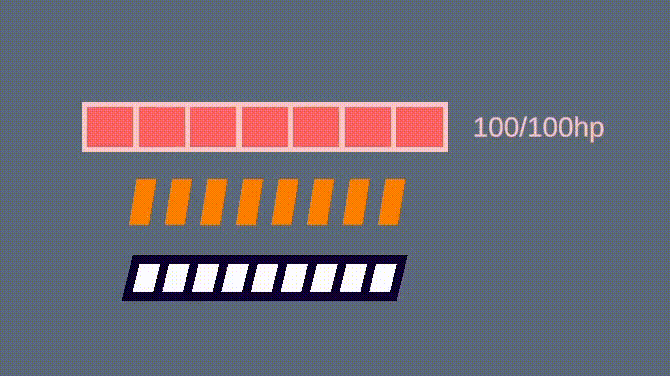
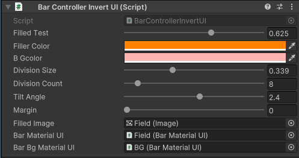
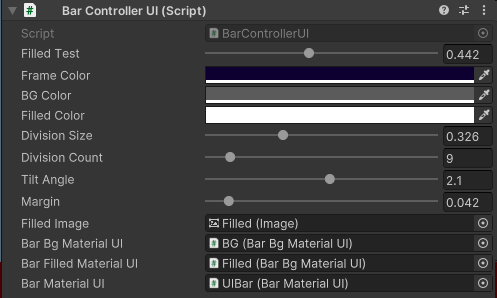

# Light UI Bar

## Облегчённые бары, реализованые через шейде, если вы нуждаетесь в большом количестве баров одновременно.


### Пример:

```csharp
using BarShadersUI.Script;
using UnityEngine;

public class BarsTest : MonoBehaviour
{
    [SerializeField] private BarControllerUI barControllerUI;
    [SerializeField] private BarControllerInvertUI barControllerInvertUI1;
    [SerializeField] private BarControllerInvertUI barControllerInvertUI2;

    private float _currentHealthValue;
    private float _maxHealth;
    private float _speedBleeding = 10;

    void Start()
    {
        _currentHealthValue = 100;
    }

    void FixedUpdate()
    {
        if (_currentHealthValue <= 0) return;

        _currentHealthValue -= Time.fixedDeltaTime * _speedBleeding;

        barControllerUI.SetFilled(_currentHealthValue / _maxHealth);
        barControllerInvertUI1.SetFilled(_currentHealthValue / _maxHealth);
        barControllerInvertUI2.SetFilled(_currentHealthValue / _maxHealth);
    }
}
```
Реализованые префабы не содержат текста, его нужно отображать отдельно.
### Демо:

### Пример реализации:


### Тест 1024 бара изменяются одновременно(120fps в неактивном состоянии):


